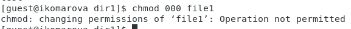
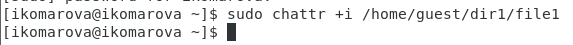

# Презентация к лабораторной работе 4.
## Дискреционное разграничение прав в Linux. Расширенные атрибуты

## Выполнила студентка группы НФИбд-02-19: Комарова Ирина Сргеевна 1032192866

## Задание
    Получение практических навыков работы в консоли с расширенными атрибутами файлов.

## Теоретическое введение
В Linux, как и в любой многопользовательской системе, абсолютно естественным образом возникает задача разграничения доступа субъектов — пользователей к объектам — файлам дерева каталогов.

Один из подходов к разграничению доступа — так называемый дискреционный (от англ, discretion — чье-либо усмотрение) — предполагает назначение владельцев объектов, которые по собственному усмотрению определяют права доступа субъектов (других пользователей) к объектам (файлам), которыми владеют.

Дискреционные механизмы разграничения доступа используются для разграничения прав доступа процессов как обычных пользователей, так и для ограничения прав системных программ в (например, служб операционной системы), которые работают от лица псевдопользовательских учетных записей.

Назначаются владельцы файлов при их создании — обычно пользователем — владельцем файла становится пользователь, создавший файл, а группой — владельцем файла становится его первичная группа.

Изменяются пользователь — владелец файлов только суперпользователем root при помощи команды chown, а группа-владелец — владельцем файла в при помощи команды chgrp, но только на ту, к которой он сам принадлежит.

## Ход работы.
1. От имени пользователя guest определила расширенные атрибуты файла
/home/guest/dir1/file1 командой
lsattr /home/guest/dir1/file1
2. Установила командой
chmod 600 file1
на файл file1 права, разрешающие чтение и запись для владельца файла.
3. Попробовала установить на файл /home/guest/dir1/file1 расширенный атрибут a от имени пользователя guest:
chattr +a /home/guest/dir1/file1
В ответ получила отказ.

4. повысла свои права с помощью команды su. Попробовала установить расширенный атрибут a на файл /home/guest/dir1/file1 от имени суперпользователя:
chattr +a /home/guest/dir1/file1
Успех.

5. От пользователя guest проверила правильность установления атрибута:
lsattr /home/guest/dir1/file1

6. Выполнила дозапись в файл file1 слова «test» командой
echo "test" /home/guest/dir1/file1
После этого выполните чтение файла file1 командой
cat /home/guest/dir1/file1
Убедилась, что слово test было успешно записано в file1.

7. Попробовала удалить файл file1 либо стереть имеющуюся в нём информацию командой
echo "abcd" > /home/guest/dirl/file1
Попробовала переименовать файл. Получла октаз во всех операциях.

8. Попробовала с помощью команды установить на файл file1 права, запрещающие чтение и запись для владельца файла. Получла отказ.

9. Сняла расширенный атрибут a с файла /home/guest/dirl/file1 от имени суперпользователя командой
chattr -a /home/guest/dir1/file1

Повторите операции, которые ранее не удавалось выполнить. Часть получилось выполнить, часть нет.

10. Повторила действия по шагам, заменив атрибут «a» атрибутом «i».

## Вывод 
    Я получила практические навыки работы в консоли с расширенным атрибутам файлов.

## Библиография
1. Методические материалы курса. “Информационная безопасность компьютерных сетей” Кулябов Д. С.,Королькова А. В., Геворкян М. Н.